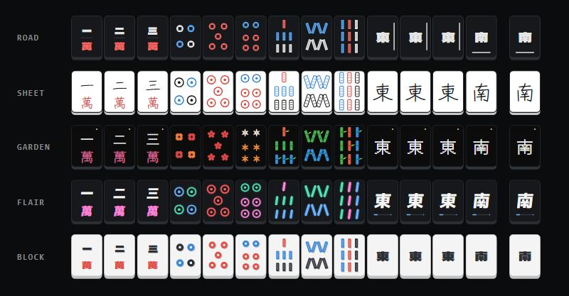

# Lines Tiles

Animated mahjong tiles in the style of **Lines**, in five sets:

- **Road** — the race on a tile: soft white roads on a dark tile, every coin is the car, and one dim light laps each tile's rim. The 1 sou is an S-bend with a car driving to the finish line.
- **Sheet** — the Lines editor in ink: white paper, black ink, blue and red pencil. The lines boil like hand-drawn animation.
- **Garden** — a flower bed for every number: sunflower, rose, trillium, poppy, cherry blossom, lily, starflower, cosmos and aster. Where nature allows, the petals count the tile (3, 4, 5, 6, 7, 8). The bamboo are bright jointed stalks whose leaves flutter.
- **Flair** — neon on a dark tile: crisp marks over a soft, steady glow, and a slow sheen that crosses each tile now and then.
- **Block** — the 3D view: every mark a softly extruded block on a light tile, the depth drifting as if the camera moved.



Every tile is live SVG drawn by one small script (`lines-tiles.js`, about 42 KB, 13 KB gzipped). No images, no dependencies, no build step. The motion is plain CSS.

Open `index.html` for the live demo: every tile, a playable hand, and a box where you type a hand and see it drawn. Open `showcase.html` for an auto-playing, full-screen reel of the five sets.

## Show it from your own computer

Double-click `show-tiles.bat` (Windows), or run:

```
python serve.py
```

It needs only Python 3. It serves this folder to your computer alone and opens the showcase in your browser. To let a phone or laptop on the same Wi-Fi open it as well, run `python serve.py --lan`; it prints the address to type there. Close the window, or press Ctrl+C, to stop it.

In the showcase: the arrow keys change the set, Space pauses, F goes full screen.

## Quick start

```html
<script src="lines-tiles.js"></script>

<lines-tile set="flair" tile="5p"></lines-tile>
<lines-hand set="sheet" tiles="123m 406p 789s 11z"></lines-hand>
```

That's all. The script defines two HTML elements:

| Element | Attributes |
|---|---|
| `<lines-tile>` | `set`, `tile`, `size`, `motion` |
| `<lines-hand>` | `set`, `tiles`, `size`, `motion` |

- `set`: `road`, `sheet`, `garden`, `flair` or `block`.
- `tile`: one tile code (below).
- `tiles`: a hand in the usual notation (below).
- `size`: tile width in pixels, default `48`. The height follows (86/60 of the width).
- `motion`: `on` (default), `hover` (moves only under the pointer) or `off`.

Changing an attribute later redraws the element.

## Three ways to put it on a website

**1. Copy the file.** Put `lines-tiles.js` next to your page and use the quick start above.

**2. Load it from a CDN, straight from this GitHub repo.** [jsDelivr](https://www.jsdelivr.com/) serves files from public GitHub repos, no upload needed:

```html
<script src="https://cdn.jsdelivr.net/gh/calicocowz/Mahjong-Animated-Tiles@v1.3.0/lines-tiles.js"></script>
```

`@v1.3.0` pins this version (the git tag `v1.3.0`), so a later change to the repo can never change a site that uses it. To move to a newer version, change the number.

**3. Use the demo as a page.** In the repo's *Settings → Pages*, choose *Deploy from a branch*, then `main` and `/ (root)`. The pages then go live at `https://calicocowz.github.io/Mahjong-Animated-Tiles/` (the demo) and `https://calicocowz.github.io/Mahjong-Animated-Tiles/showcase.html` (the showcase).

## Tile codes

| Code | Tile |
|---|---|
| `1m` … `9m` | characters (man) |
| `1p` … `9p` | dots (pin) |
| `1s` … `9s` | bamboo (sou) |
| `0m` `0p` `0s` | red fives |
| `1z` `2z` `3z` `4z` | East, South, West, North |
| `5z` `6z` `7z` | White, Green, Red dragon |
| `back` | the back of a tile |

## Hand notation

`<lines-hand>` takes the notation most mahjong sites use: digits, then the suit letter they belong to.

```
123m456p789s1122z    1-2-3 man, 4-5-6 pin, 7-8-9 sou, East East South South
406p                 4 pin, red 5 pin, 6 pin
123m456p789s112z 2z  a space leaves a gap, e.g. before the drawn tile
```

Upper case works too. If the notation is wrong, the element shows the text as typed, and its tooltip (`title`) says what is wrong.

## JavaScript

Everything is on `window.LinesTiles`:

```js
LinesTiles.svg("flair", "7z", { size: 48, motion: "hover" })  // SVG markup for one tile
LinesTiles.hand("sheet", "123m406p", { size: 36 })             // markup for a whole hand
LinesTiles.parseHand("12m 3p")   // ["1m", "2m", null, "3p"]   (null = gap)
LinesTiles.label("0p")           // "red 5 pin"
LinesTiles.sets                  // ["road", "sheet", "garden", "flair", "block"]
LinesTiles.tiles                 // every tile code, in order
LinesTiles.version               // "1.3.0"
```

`svg`, `hand` and `parseHand` throw an `Error` on an unknown set, tile or notation.

The markup works anywhere HTML does: React (`dangerouslySetInnerHTML`), Vue (`v-html`), or plain `innerHTML`.

## Motion and accessibility

- A visitor whose system asks for reduced motion always gets still tiles, whatever `motion` says.
- Screen readers hear each tile's name ("red 5 pin", "East"), and a whole hand as one description listing its tiles.
- `motion="hover"` keeps a page calm and lets a tile move when it is pointed at.

## Fonts and privacy

The kanji use four fonts from Google Fonts, all under the SIL Open Font License 1.1: **Dela Gothic One** (Road and Block), **Zen Kurenaido** (Sheet), **DotGothic16** (Garden) and **M PLUS 1p** (Flair). The script loads one small stylesheet that lists all four; the browser then downloads font files only for the sets a page actually shows. The script adds the font stylesheet itself. Google splits each font into small slices, and a browser downloads only the slices holding characters the page shows.

Loading fonts from Google tells Google each visitor's IP address. Some sites, especially in the EU, prefer to host fonts themselves. To do that:

1. Set `window.LinesTilesNoFonts = true;` before loading `lines-tiles.js`.
2. Serve the fonts of the sets you use yourself. A tool like [google-webfonts-helper](https://gwfh.mranftl.com/fonts) can download them with ready-made CSS.

Without these fonts, the kanji fall back to the device's own Japanese font. Windows, macOS, iOS and Android all include one; some Linux systems do not.

## Browser support

The script needs a browser with custom elements and ES2015, which is every current version of Chrome, Edge, Firefox and Safari. It has been tested in Chromium (Chrome and Edge); Firefox and Safari have not been checked yet.

## Copyright

- The tile system itself (the three suits, winds, dragons and the traditional arrangement of the dots and sticks) is centuries old and in the public domain.
- Every drawing here is original code written for this set. Nothing is traced, sampled or copied from any commercial tile art, and the set uses no images.
- The look comes from Lines.
- The fonts are under the SIL Open Font License 1.1, which allows their use on websites and in games, including commercial ones.

## Licence

None, on purpose. This set was made for its owner and a friend; all rights are reserved, and anyone else who wants to use it needs the owner's permission.
